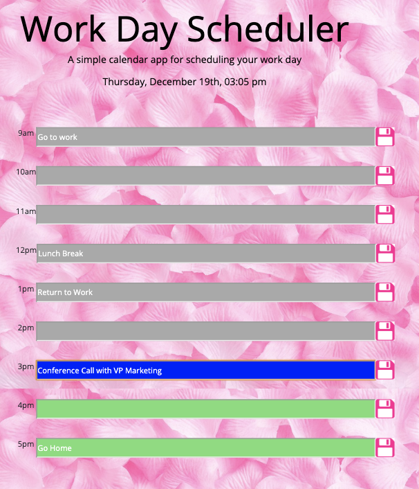
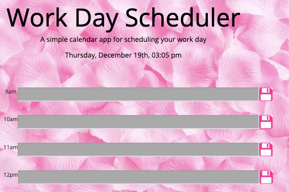

# Unit5HW

The goals of this assignment are to create a Day Planner that:

* Displays timeblocks for standard business hours (9 a.m. to 5 p.m.).

* Has each timeblock contain an input field and save button.

* Allows clicking a timeblock's "Save" button to store the input text in local storage, as well as allows text to persist when the application is refreshed.

* Has the current day displayed at the top of the calendar.

* Has each timeblock as color coded to indicate whether it is in a past, present, or future hour.

* IMPORTANT: This Day Planner has been coded and designed specifically for Desktop use. 

Website Link: https://melanierogoff.github.io/Unit5HW/

Screenshots (Desktop Versions With Text & Without Text, Respectively):

